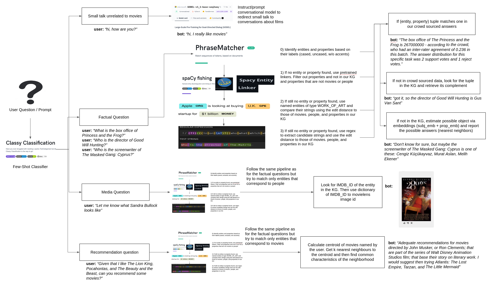

# Course Project

## Setup 
One of the libraries used has to be installed in a specific order, otherwise it fails. Because of this, the order of commands in `setup.sh` should be followed.

The `conda_env.yml` is there only for refence. Do not use to recreate a conda environment because it will fail.

## Run
From the `./code` directory and run the following line
    
    python run.py 

The main input files and parameters of the chatbot are in `config.yaml`

## How it works
